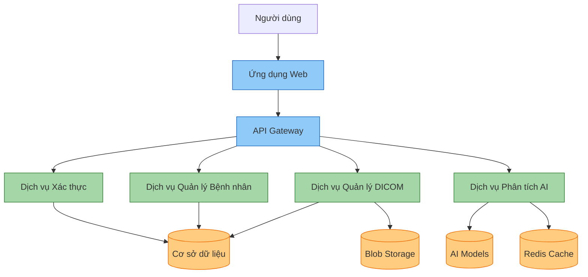
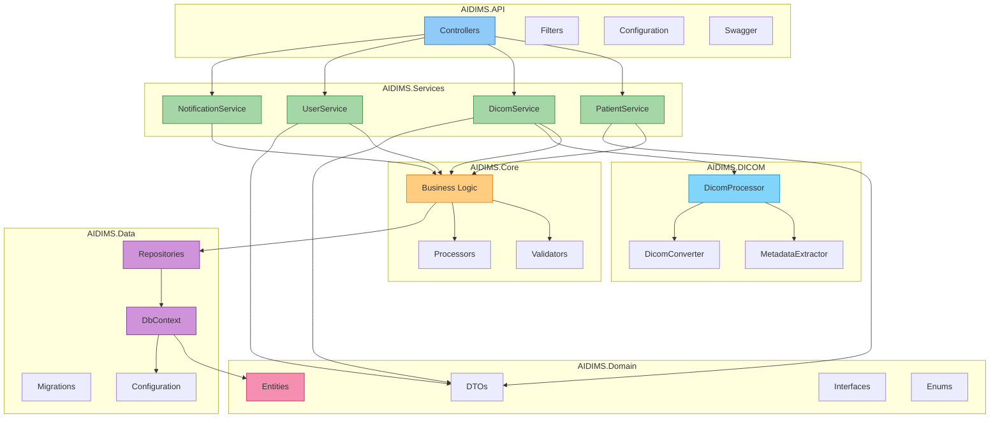
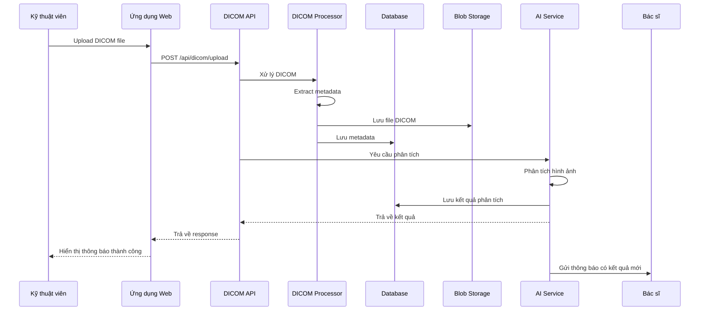
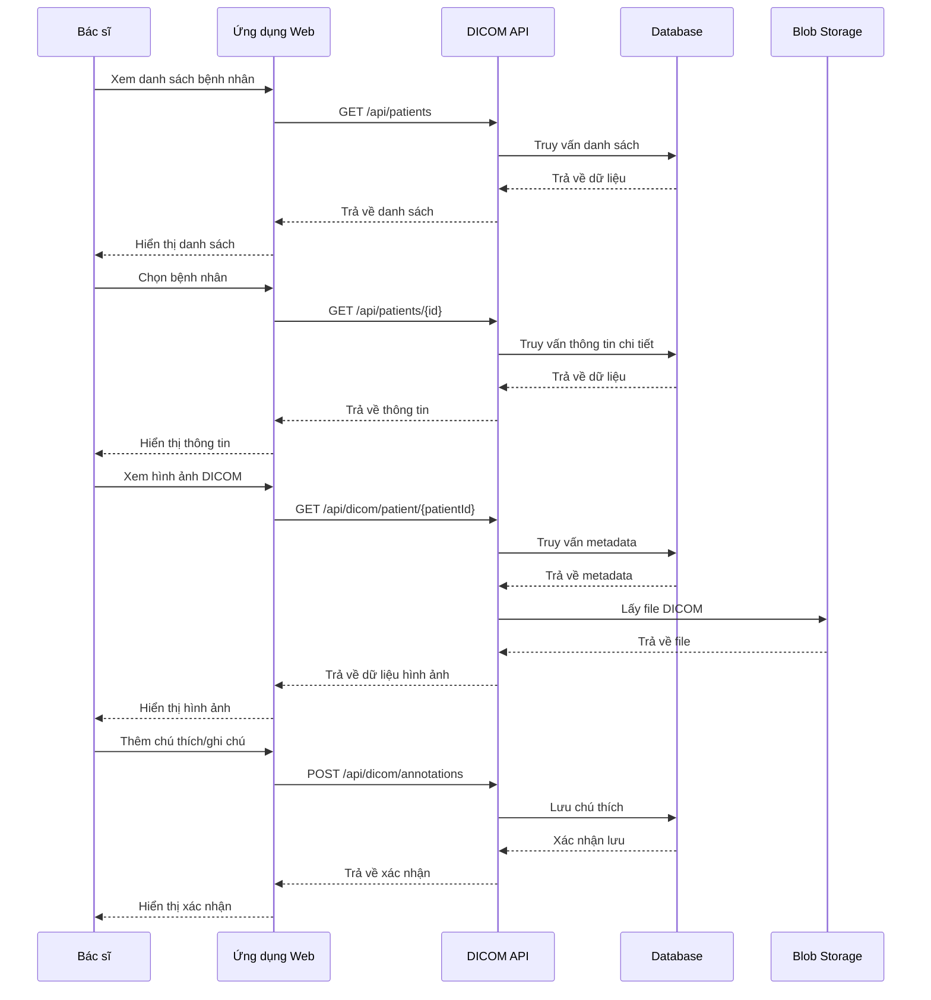
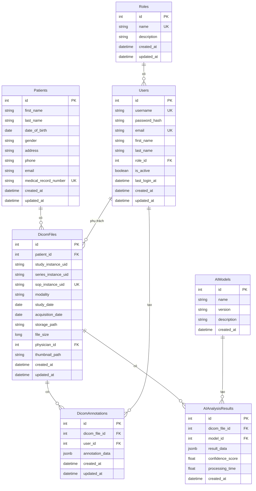
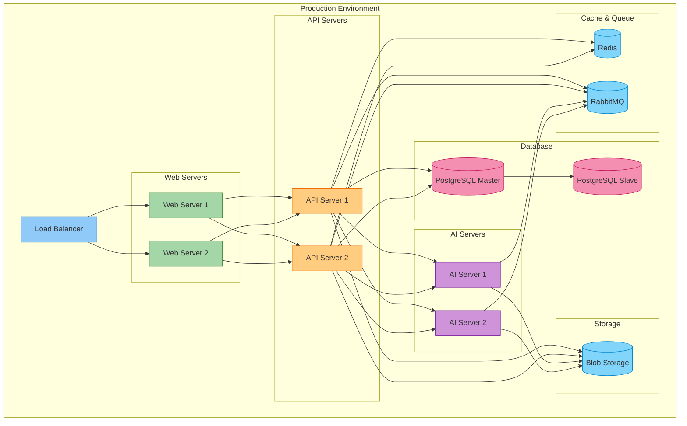

# Thiết kế Kiến trúc Hệ thống AIDIMS

## 1. Kiến trúc Tổng thể

Hệ thống AIDIMS được xây dựng theo kiến trúc nhiều tầng (multi-tier architecture) kết hợp với microservices cho module AI.

## 2. Kiến trúc Chi tiết Backend

## 3. Luồng Xử lý Dữ liệu

### 3.1. Luồng Upload và Phân tích DICOM

### 3.2. Luồng Xem và Chẩn đoán

## 4. Mô hình Cơ sở Dữ liệu

## 5. Kiến trúc Triển khai

## 6. Luồng CI/CD

```mermaid
graph LR
    subgraph "Development"
        Dev[Developer]
        LocalBuild[Local Build]
        GitRepo[GitHub Repository]
    end
    
    subgraph "CI/CD Pipeline"
        Build[Build]
        UnitTest[Unit Tests]
        CodeQuality[Code Quality]
        IntTest[Integration Tests]
        Package[Package]
    end
    
    subgraph "Deployment"
        DeployDev[Deploy to Dev]
        TestDev[Test in Dev]
        DeployStaging[Deploy to Staging]
        TestStaging[Test in Staging]
        DeployProd[Deploy to Production]
        Monitor[Monitor]
    end
    
    Dev -->|commit| LocalBuild
    LocalBuild -->|push| GitRepo
    GitRepo -->|trigger| Build
    Build --> UnitTest
    UnitTest --> CodeQuality
    CodeQuality --> IntTest
    IntTest --> Package
    Package --> DeployDev
    DeployDev --> TestDev
    TestDev --> DeployStaging
    DeployStaging --> TestStaging
    TestStaging --> DeployProd
    DeployProd --> Monitor
    
    style Dev fill:#90CAF9,stroke:#1565C0
    style GitRepo fill:#90CAF9,stroke:#1565C0
    style Build fill:#A5D6A7,stroke:#2E7D32
    style UnitTest fill:#A5D6A7,stroke:#2E7D32
    style CodeQuality fill:#A5D6A7,stroke:#2E7D32
    style IntTest fill:#A5D6A7,stroke:#2E7D32
    style Package fill:#A5D6A7,stroke:#2E7D32
    style DeployDev fill:#FFCC80,stroke:#EF6C00
    style DeployStaging fill:#FFCC80,stroke:#EF6C00
    style DeployProd fill:#FFCC80,stroke:#EF6C00
    style Monitor fill:#FFCC80,stroke:#EF6C00
``` 

